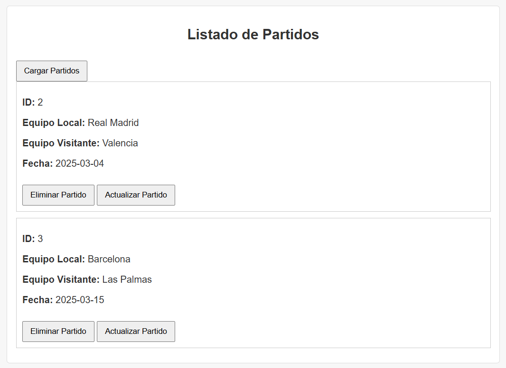
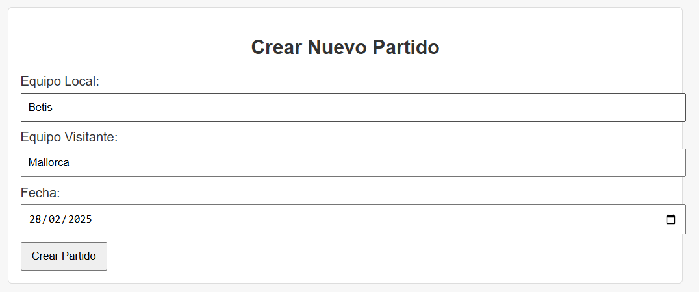
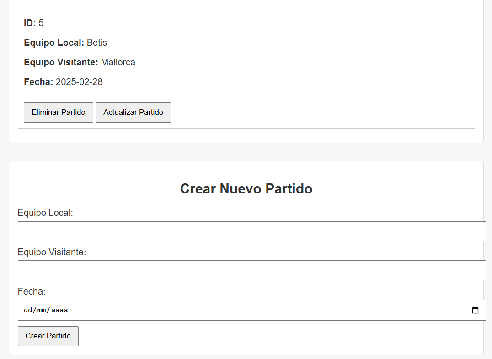
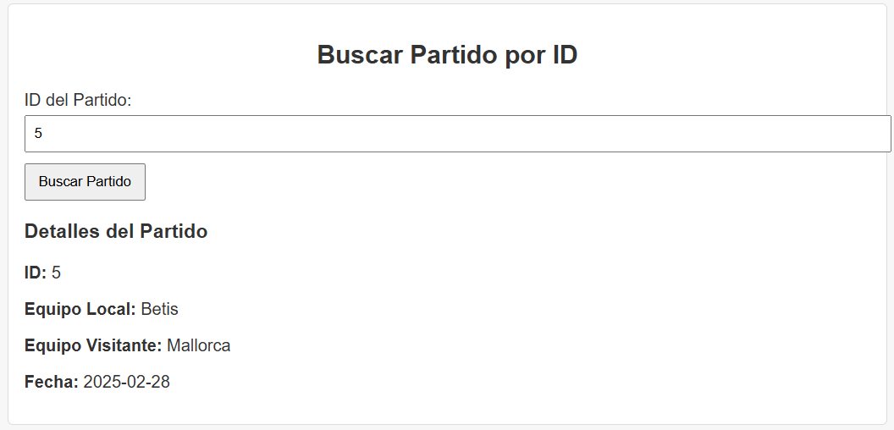
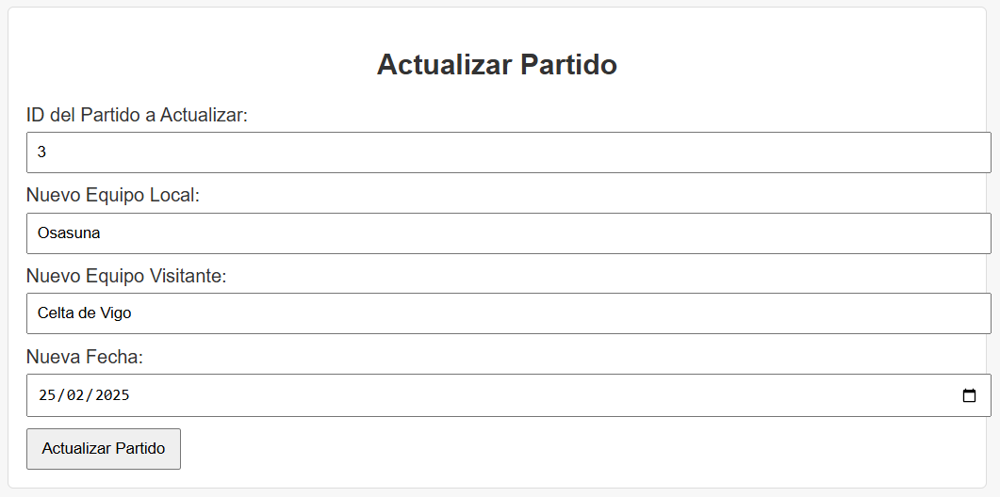
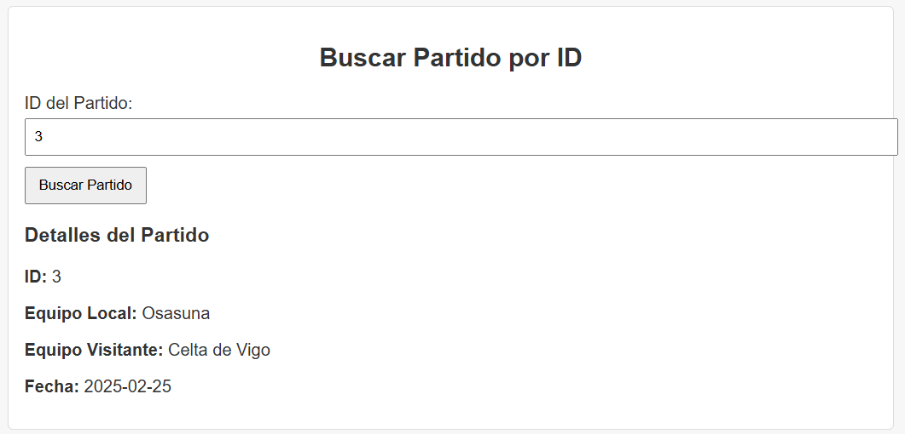
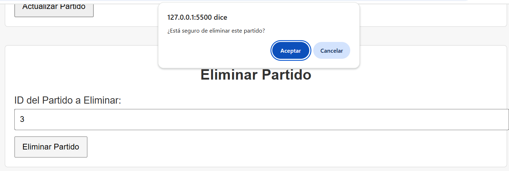
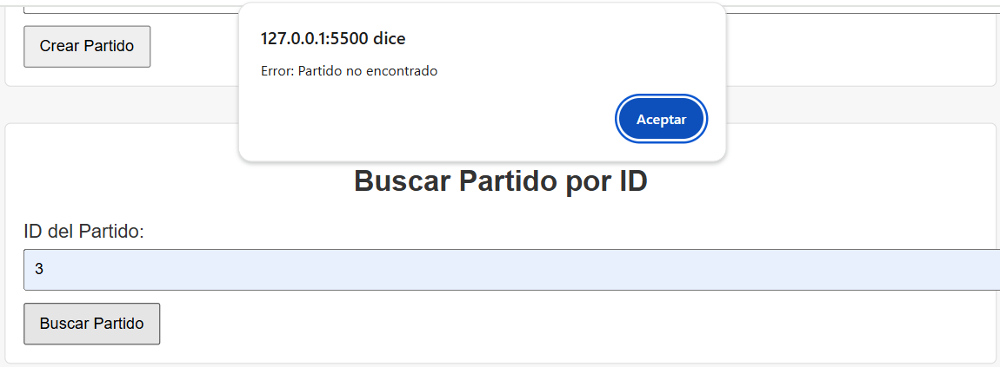

# ⚽ La Liga Tracker - Backend

Este es el backend desarrollado en **Go** para el proyecto **La Liga Tracker**, una aplicación web que permite gestionar partidos de La Liga Española.

El backend expone una API REST que se comunica con un frontend HTML ya existente, permitiendo crear, listar, buscar, actualizar y eliminar partidos.

---

## 🛠 Tecnologías usadas

- **Go (Golang)** como lenguaje principal
- **Gorilla Mux** como router para la API
- **Docker** para el despliegue del backend en el puerto `8080`

---

## ✅ Funcionalidades implementadas

### Endpoints disponibles (`/api/matches`)

- `GET /api/matches` – Obtener todos los partidos
- `GET /api/matches/{id}` – Obtener un partido por ID
- `POST /api/matches` – Crear un nuevo partido
- `PUT /api/matches/{id}` – Actualizar un partido
- `DELETE /api/matches/{id}` – Eliminar un partido

---

## 🚀 Cómo ejecutar el backend

### 🔧 Requisitos
- Tener Docker instalado y corriendo
- Tener el archivo `LaLigaTracker.html` para el frontend

### 📦 Construir imagen Docker y Ejecutar el contenedor

```bash
docker build -t laliga-backend .

docker run -p 8080:8080 laliga-backend
```

## 🌐 Desplegar el HTML (Frontend)

Para ejecutar el frontend y permitir la comunicación con el backend, recomiendo utilizar **Live Server** en VSCode.


## 📸 Capturas de Funcionalidad

### 📋 Listado de Partidos
> Muestra todos los partidos registrados en el sistema.



---

### ➕ Crear Nuevo Partido
> Permite registrar un nuevo partido con equipo local, visitante y fecha.




---

### 🔍 Buscar Partido
> Permite buscar un partido específico por su ID.



---

### ✏️ Actualizar Partido
> Permite modificar los datos de un partido existente.




---

### 🗑️ Eliminar Partido
> Permite borrar un partido del sistema.



